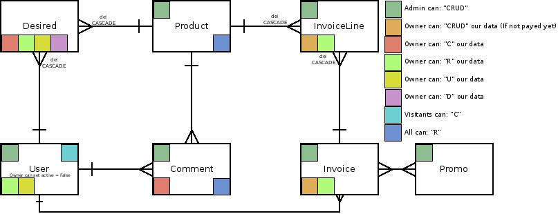
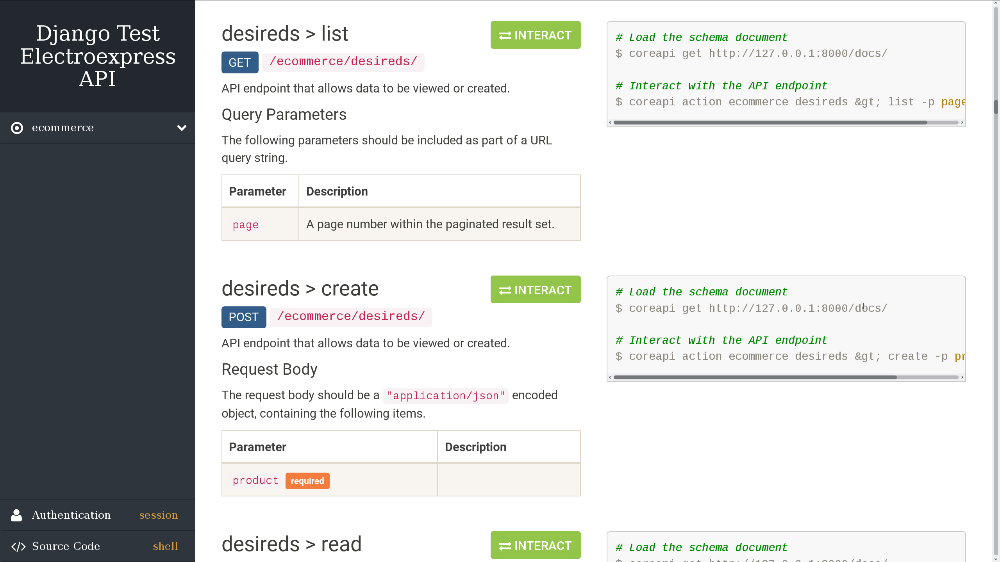

# Documentación del API


## Esquema de modelos




> En la apuesta original se esperaba implementar también comentarios con valoraciones sobre los productos, realizar herencia de `auth.User` sobre un modelo propio de usuarios y poder aplicar "stacks" de productos por cada línea de la factura, pero por cuestiones de tiempo no ha sido posible y se ha buscado un **MVP** para la prueba.

El UML Representa las relaciones entre modelos visto desde un punto de vista bastante orientado a DDBB, donde se obserava que un usuario (`auth.User`) tiene una lista de productos deseados (`Desired` en 1:N), puede generar comentarios (`Comment` 1:N) de los productos y luego puede gestionar facturas (`Invoice`) donde las facturas están compuestas por múltiples productos (`InvoiceLine` 1:N), los cuales pueden aparecer en una proporción de 1 a N veces en cada línea (es decir, una factura puede tener tres móviles iguales en una línea). Además, las a las facturas se les puede aplicar códigos promocionales (`Promo` N:N) con lo que se conseguirá un descuento sobre el precio total del sumatorio de todos los productos comprados.


## Especificaciones de los modelos

Como especificaciones del **modelo de facturas**, a partir de ahora referenciado como el modelo *invoices*, podemos destacar que además se le aplican gastos de envíos, gestionados por un campo *choosable* definido sobre el propio modelo. También destacan una serie de campos autocalculados que hacen uso del decorador `@property` para gestionar el descuento aplicable del sumatorio de todas las *promos*, el precio total de las invoicelines, referenciado a partir de ahora como *lines*, o el precio resultante del *invoice* (Una vez se han aplicado los precios de los *lines*, el descuento de las *promos* y los *shipping costs*).

Debido a la naturaleza de los *invoices*, el nombre con el cual se referencia a la propia factura es gestionado con el módulo **django-sequences**, el cual mediante la ayuda del bloqueo de DDBB permite una asignación unívoca del nombre aplicado a la factura, el cual se identifica con el número del ejercicio anual.

```python
from sequences import get_next_value

class Invoice(models.Model):
    # ...

    @transaction.atomic
    def _sequence_next_name(self):
        """Generate and return a sequence for name.

        This method block all transactions.
        """
        year = date.today().strftime('%Y')
        seq_name = '{prefix}:{sufix}'.format(
            prefix=self.__module__,
            sufix=year)
        return '{prefix}{year}/{next}'.format(
            prefix=settings.INVOICE_SEQUENCE_PREFIX,
            year=year,
            next='{:04d}'.format(get_next_value(seq_name))
        )

    def save(self, *args, **kwargs):
        """Overwrite save for autogenerated name."""
        self.name = self._sequence_next_name()
        super().save(*args, **kwargs)

```

Cuando trabajamos con **un catálogo de productos** se da la necesidad de gestionar el stock de los mismos, por lo que se ha generado filtrado sobre los serializadores para que en caso de que un producto no tenga stock este, no sea mostrado en la web (*Se ha decidido hacer así para aplicar algún `filter` en el ejercicio.*), además, si el producto ya no es recibido en tienda (`was?discontinued`) o no tiene `stock` es señalado sobre el nombre del mismo gracias a `__str__(self)`.

**Las promociones** tienen como particularidad que pueden ser aplicadas de manera porcentual o de manera directa sobre el coste del *invoice*, para ello existe un choosable donde dependiendo la selección se realiza el cálculo aplicado correspondiente en el modelo de las `invoices`.

**Se ha definido  la constante**  `USD` sobre `settings.py` para centralizar algún parámetro en el proyecto, dicha constante es consumida por las *promos* en la función `__str__(self)` como por las *invoices* en el choosable de `shipping_cost`.


## API


#### Endpoints

En este punto tuve bastantes problemas debido a que entre `PUT`, `GET`, `POST` tenía diferencias de comportamiento cuando retornaba los diccionarios de los hijos (los `InvoiceLine` de un `Invoice` por ejemplo), siendo obligada a generar un API muy alejada de la filosofía Restful, por lo que al final me decanté por simplificar los `JSON` devueltos en pro de tener un API Restful clara y concisa.

`GET`, `POST`: *http://localhost:8000/ecommerce/desireds/*

`GET`, `PUT`, `DELETE`: *http://localhost:8000/ecommerce/desireds/\<int:pk>/*

`GET`, `POST`: *http://localhost:8000/ecommerce/products/*

`GET`, `PUT`, `DELETE`: *http://localhost:8000/ecommerce/products/\<int:pk>/*

`GET`, `POST`: *http://localhost:8000/ecommerce/invoices/*

`GET`, `PUT`, `DELETE`: *http://localhost:8000/ecommerce/invoices/\<int:pk>/*

`GET`, `POST`: *http://ocalhost:8000/ecommerce/promos/*

`GET`, `PUT`, `DELETE`: *http://localhost:8000/ecommerce/promos/\<int:pk>/*


| Recursos / Estado | POST  |       GET        |   PUT    | DELETE |
| :---------------: | :---: | :--------------: | :------: | :----: |
|    /invoices/     | Crea  |  Devuelve lista  |    -     |   -    |
|    /invoices/1    | Error | Devuelve detalle | Modifica | Borra  |


#### API y particularidades

* `GET` *http://localhost:8000/ecommerce/desireds/*

  ```json
  // HTTP 200 OK
  {
      "count": 2,
      "next": null,
      "previous": null,
      "results": [
          {
              "owner": 1,
              "product": 1
          }
      ]
  }
  ```

* `POST` *http://localhost:8000/ecommerce/desireds/*

  ```json
  // HTTP 201 Created
  {
      "owner": 1,
      "product": 5
  }
  ```

* `PUT` *http://localhost:8000/ecommerce/desireds/1*

  ```json
  // HTTP 200 OK
  {
      "owner": 1,
      "product": 13
  }
  ```

* `DELETE` *http://localhost:8000/ecommerce/desireds/1*

  ```json
  // HTTP 204 No Content
  ```

El comportamiento del API ha sido unificado para todos los modelos, por lo  que evitaré la redundancia en el documento. Lo que sí que explicaremos serán las particularidades.


###### Las facturas `Invoice`

1. Una factura no puede ser modificada ni borrada si ya ha sido pagada. El pago se representa mediante el campo `payment_date`. Cuando una factura ha sido pagada deja de tratarse como "carrito" y pasa a ser una factura propiamente dicha.
2. Las facturas sólo pueden ser visualizadas por el usuario propietario de la misma.


###### Los productos `Product`

1. Los productos sólo pueden ser creados, actualizados y modificados por los usuarios administradores.
2. Un producto que ya tiene facturas generadas y pagadas no puede ser modificado ni borrado (Debería de ser posible modificar exclusivamente el precio ya que el modelo `InvoiceLine`, el cual es la tabla relacional entre `Invoice` y `Product` almacena un valor propio para el precio. Debido a la falta de tiempo y la necesidad de sacar en adelante un **MVP** no ha sido implementada dicha lógica).
3. Todos los visitantes (ya estén registrados o no) pueden ver la lista de productos y el detalle de cada producto.


###### Los deseados `desireds`

1. Los productos deseados sólo pueden ser consultados, modificados, borrados y creados por el usuario propietario.


###### Las promociones `Promo`

1. Las promociones pueden ser vinculadas a las facturas por cualquier usuario.
2. Sólo los usuarios administradores tienen autorización completa sobre las promociones.
3. Una promoción que ha sido vinculada a una factura ya pagada no puede ser editada ni borrada (Sólo desactivada **PENDIENTE**).


#### Documentación propia de django-rest-framework

El proyecto cuenta con una documentación básica del API generada automáticamente por django-rest-framework, accesible desde https://localhost:8000/docs


